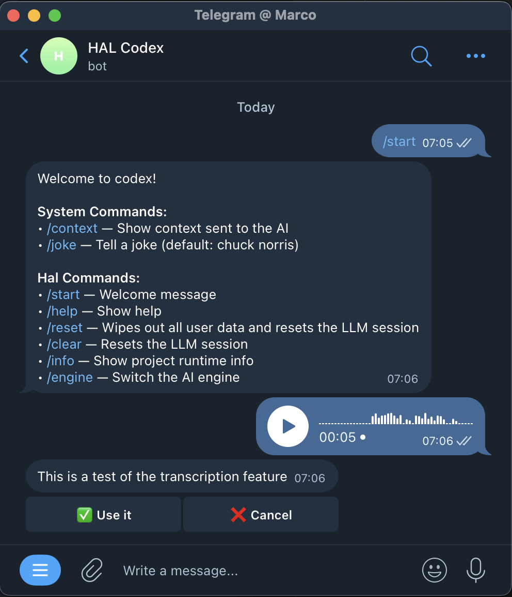

Talk to your notes, with HAL!

HAL turns Telegram into a remote control for AI coding agents while keeping your agent local. In v1.5.0, voice handling got much better: you can confirm a transcript before sending it to the agent, and choose the UX that fits the job with confirm, inline, or silent transcription modes.

If you use coding agents away from the keyboard, this makes quick Telegram voice messages much easier to trust.

Voice docs:
https://github.com/marcopeg/hal/blob/main/docs/voice/README.md

Which mode would you use most: confirm, inline, or silent?

#Telegram #VoiceAI #DevTools #AICoding #Whisper